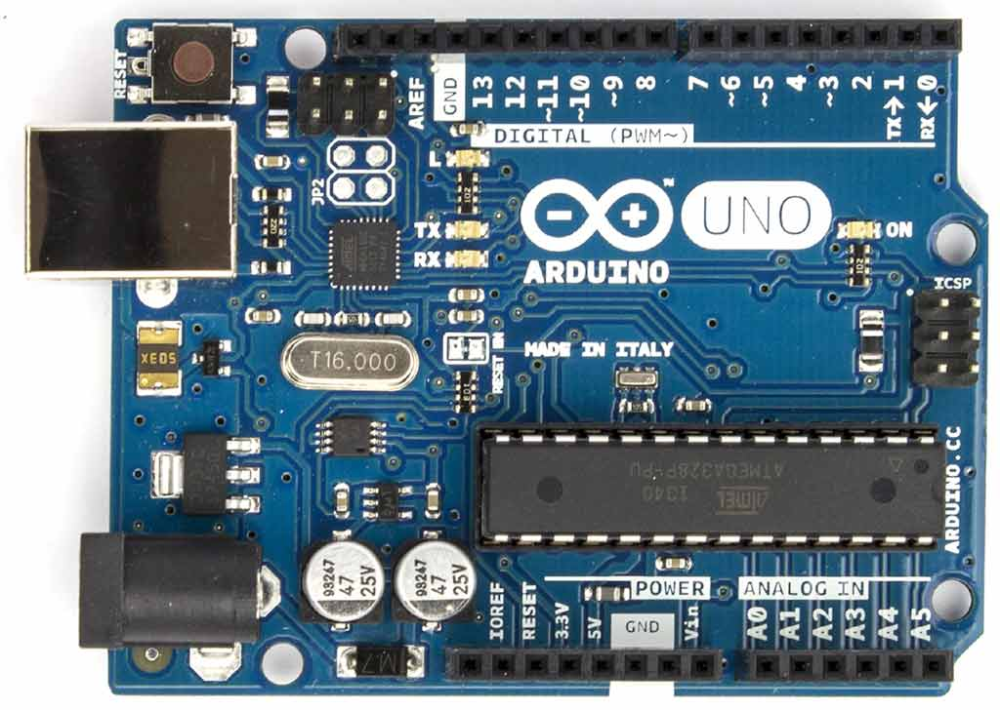
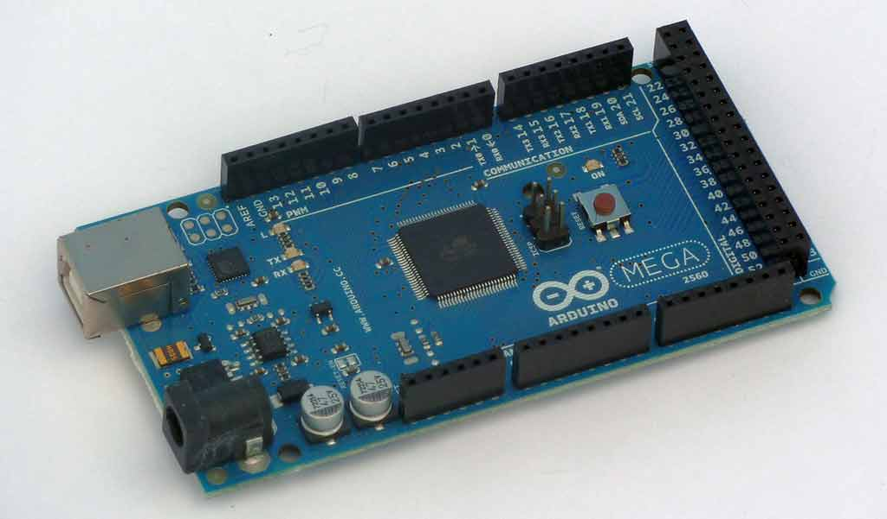

## 1. Mais qu'est-ce que c'est Arduino, d'abord?

### 1.1. Photo d'une Uno

Arduino, ce sont des cartes électroniques programmables, avec un certain nombre d'entrées/sorties. Quoi ? c'est pas précis ? OK, je recommence.

Une carte Arduino, ça ressemble (de manière non exhaustive, parce qu'il y a enormément de modèles et de clones) à ceci : 



C'est une carte électronique open source, constituée essentiellement de :
* un microcontrôleur fabriqué par Atmel,
* un port USB,
* des connecteurs d'entrés/sortie (plus ou moins nombreux selon les modèles).

L'open hardware, par analogie à l'open software, permet de partager les plans pour pouvoir répliquer, améliorer, comprendre un dispositif matériel.

Arduino, c'est aussi un IDE (disons plutôt un éditeur de code) qui permet d'envoyer les programmes sur la carte à travers un port USB.

Il est open source et [disponible ici](https://www.arduino.cc/en/main/software).

### 1.2. Spécifications du matériel
Le modèle Uno présenté ici dispose, accrochez-vous, de :
* 32 ko de mémoire pour stocker les programmes,
* 2 ko de RAM, une EEPROM 1 ko pour stocker… 2 ou 3 trucs, typiquement des paramètres. Impossible d'y stocker des logs GPS, par exemple ;
* et tout ce petit monde est cadencé à la fréquence totalement dingo de 16 MHz !

Tout ça pour la modique somme d'une vingtaine d'euros (pour les authentiques), et une dizaine d'euros — voire moins — pour les clones.

### 1.3. Mais à quoi ça sert?
"C'est quoi ces specs, c'est une blague ? Qu'est-ce qu'on peut faire d'un bidule pareil aujourd'hui ?"

Eh bien on peut interagir avec le monde réel, car contrairement à un PC qui dispose de 3 ou 4 ports USB (et je ne parle même pas des Mac), une petite carte comme celle-ci peut gérer des moteurs, des systèmes d'affichage, des capteurs (accéléromètres, température, pression atmosphérique, luminosité, et la liste est loin d'être exhaustive).

Au final, ça sert à fabriquer des machines. Elles peuvent être autonomes, discuter entre elles ou avec un PC, et réagir à leur environnement.

La grosse vague des imprimantes 3D a eu lieu grâce à ces petits bidules. La mienne tourne avec une ATMEGA 2560 comme celle-ci (on remarquera qu'il y a beaucoup plus de pins sur celle-ci) :



Ma fraiseuse CNC dans le garage tourne avec une simple Arduino Uno, qui reçoit les commandes depuis un PC et pilote 3 axes avec des moteurs pas à pas assez balaises.

Le projet ArduPilot propose des firmwares et shields (extensions qui se connectent directement sur la carte) destinés à gérer des drones (multicoptères, avions, rovers) dans toutes leurs fonctions (moteurs, stabilisation, GPS, altimètre…)

### 1.4. Principe de fonctionnement
Le principe, rapidement évoqué dans la toute première phrase, est d'utiliser les pins (i.e. les connecteurs numérotés que l'on peut voir sur la photo) pour lire ou écrire des informations.

OK, OK, les informations sont de très bas niveau, vu que c'est un signal soit de 5 V, soit de 0 V.

Un bit, quoi. Tout juste de quoi faire clignoter un LED (**spoiler** : c'est ce que nous allons faire tout de suite).

Nous verrons plus tard que des protocoles de communication sont à notre disposition pour ne pas se taper l'écriture des bits un par un sur une pin (c'est très sexuel comme terminologie hein).

**Mais vous l'aurez compris, globalement, on va être dans de la programmation de bas niveau.**

## 2. Structure d'un programme, langages utilisés

Allez, assez de teasing, nous allons écrire notre premier programme !

Le but ? faire clignoter une LED sur la carte. Ben oui, il faut commencer petit pour bien saisir la structure d'un programme dans cet environnement.

Le programme principal consiste en deux fonctions (ce sera toujours le cas), dont voici les signatures ultra simples :

* void setup()
* void loop()

`setup()` est appelée une seule fois, au moment de la mise sous tension de la carte.
`loop()` est appelée, comme son nom l'indique, en boucle. Elle est lancée après `setup()`, et tourne à fond à l'infini (tant que la carte est alimentée en tout cas).

Ah j'oubliais : le langage de programmation utilisé est au choix le C, ou le C++. J'ai un faible pour le C++ pour sa relative simplicité par rapport au C pur.

Donc pour reprendre sur notre programme de base, on a quelque chose comme ça :

```C
void main(){
    setup();

    while(true)
        loop();
}

```

En pratique, nous n'implémenterons que les deux fonctions `setup()` et `loop()`. Le `main()` est généré par le compilateur.

Allez, assez discuté, passons à notre programme, le grand classique **Blink**:

```C
int led = 13;

void setup() {                
  pinMode(led, OUTPUT);      // Définit la pin 13 comme pin de sortie   
}

// the loop routine runs over and over again forever:
void loop() {
  digitalWrite(led, HIGH);   // Allume la LED
  delay(1000);               // Attend une seconde
  digitalWrite(led, LOW);    // Eteint la LED
  delay(1000);               // Attend une seconde
}
```

Dans ce programme, on fait usage de 3 fonctions de la librairie standard :
* `pinMode(pinNumber, mode)` : définit le mode de fonctionnement d'une pin. À la louche, soit INPUT, soit OUTPUT ;
* `digitalWrite(pinNumber, value)` : si la pin est définie en OUTPUT, cette instruction permet d'écrire 1 ou 0. Si on mesure avec un voltmètre la tension entre la pin et la masse, on aura +5 V ou 0 V. HIGH et LOW sont des constantes prédéfinies, mais 1 ou 0 fonctionneraient aussi ;
* delay(ms) : cette instruction bloque l'exécution du programme (de **tout** le programme) pendant une durée donnée en millisecondes.

La pin 13 est très pratique, car elle est reliée à une LED intégrée à la carte. Du coup, dès qu'on active ou désactive la 13, une petite LED orange s'allume ou s'éteint.

## 3. Instructions de base

Nous venons de voir au paragraphe précédent 2 instructions qui permettent d'envoyer une information en sortie (dans ce cas, faire clignoter une LED. Paye ta gloire.)

On peut aussi **lire** une information venant de l'extérieur, avec `digitalRead(pinNumber)`.

Ca va permettre par exemple de savoir si un bouton poussoir est appuyé ou pas, si une porte est ouverte ou fermée, etc.

Par exemple, on pourrait écrire ceci :

```C
int ledPin = 13;   // LED sur la pin 13
int btnPin = 7;     // bouton poussoir sur la pin 7

void setup()
{
  pinMode(ledPin, OUTPUT);
  pinMode(btnPin, INPUT);
}

void loop()
{
  int val = digitalRead(btnPin);     // lit l'état du bouton
  digitalWrite(ledPin, val);    // allume la LED en fonction de l'état du bouton
}
```

Je vous vois venir :
"Oui, mais tu te fous un peu de nous là, on n'a qu'à connecter la LED directement au bouton !"

La réponse est oui. Mais si je voulais introduire un délai entre l'appui sur le bouton et l'allumage de la LED, ça commence à devenir intéressant.

Ou bien si l'allumage dépend d'autres capteurs branchés sur d'autres pins, comme par exemple une photorésistance. On pourrait faire en sorte que la LED ne s'allume que si la luminosité ambiante est suffisamment faible.

Mais comment savoir si la luminosité est suffisamment faible, alors que jusqu'à maintenant on n'est capable de lire que HIGH ou LOW ? Grâce à `analogRead(pinNumber)`, bien sûr !

Sur la carte en photo on peut voir une série de pins notées de A0 à A5, et leur particularité, c'est qu'elles peuvent transformer un signal analogique (une tension entre 0 et 5 V) en un entier de 0 à 1023.

Par exemple, si une photorésistance est branchée entre le +5 V et la pin A0, on peut obtenir la luminosité ambiante avec :

```C
// Pas besoin de faire un pinMode() dans le cas d'une lecture analogique.
int ambientBrightness = analogRead(A0);
```

Donc pour allumer la LED uniquement si le bouton est pressé **ET** que la luminosité ambiante est suffisamment basse (seuil à déterminer empiriquement, disons 600):

```C
int ledPin = 13;   // LED sur la pin 13
int btnPin = 7;     // Bouton poussoir sur la pin 7
int photoResPin = A0; // A0 est une constante utilisable directement
int threshold = 600;

void setup()
{
  pinMode(ledPin, OUTPUT);
  pinMode(btnPin, INPUT);
  // On éteint la LED à l'initialisation:
  digitalWrite(ledPin, LOW);
}

void loop()
{
  //lecture du bouton
  int val = digitalRead(btnPin);     // Lit l'état du bouton

  //lecture de la luminosité
  int ambientBrightness = analogRead(A0);

  if((val == HIGH && ambientBrightness < threshold) || val == LOW)
    digitalWrite(ledPin, val);    // Allume la LED en fonction de l'état du bouton ET de la luminosité
}
```

Si j'étais joueur, je permettrais à l'utilisateur de régler le seuil avec un potentiomètre relié à une autre entrée analogique, histoire de ne pas le coder en dur… Mais comme je suis un gros fainéant et que je vois des étoiles briller dans vos yeux, je vais vous laisser y réfléchir. :)


## 4. Résumé de cette première session

Un petit doliprane ou ça va ?

Pour résumer cette session, voici ce qu'il faut retenir :
* Arduino est une plateforme pour programmer des cartes électroniques (communément appelés microcontrôleurs),
* on programme en C ou en C++,
* nous avons des fonctions à disposition pour lire des entrées et écrire sur des sorties (la plupart des pins sont réversibles d'ailleurs) ;
* il y a peu de mémoire à disposition, donc l'optimisation des programmes sera cruciale pour des projets complexes.

_Crédits images : https://commons.wikimedia.org, https://www.arduino.cc_
