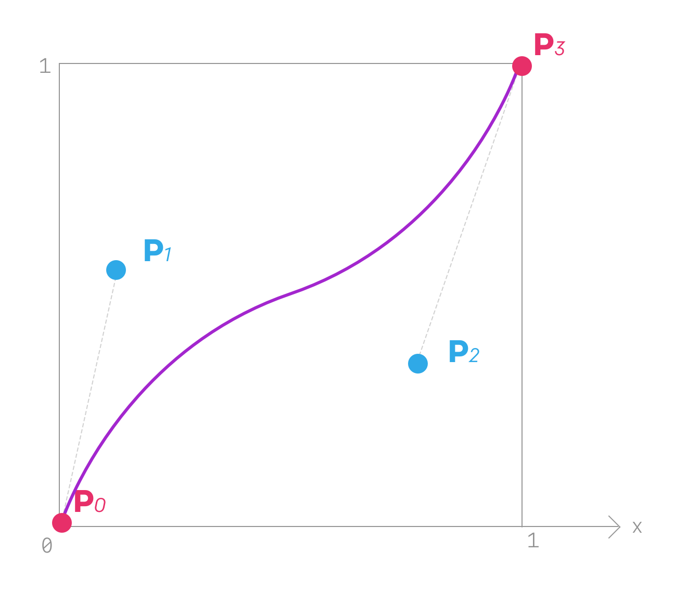

Les animations prennent une grande place dans les interfaces utilisateur. Loin de n'apporter qu'un côté esthétique, elles augmentent la performance perçue, améliorent notre expérience en nous aidant à nous repérer et en guidant notre attention. Sur les application natives, ces animations sont souvent plus naturelles que sur le web, et pour cause, beaucoup de leurs animations sont des *springs*.

Qu'est-ce qu'une animation *spring* ? Pour arriver à le définir, voyons comment on a l'habitude de créer des animations avec les technologies web.

CSS possède deux propriétés permettant d'animer des valeurs: les `animation` et les `transition`. Au delà de la différence entre leurs capacités au sein de CSS (propriété vs ensemble de propriété avec des étapes), les deux reposent sur le même mécanisme. On va donc étudier le plus simple: `transition`.

```css
.block {
  transition: 300ms linear transform;
}

.block:hover {
  transform: scale(1.05);
}
```

Cette transition est définie sur un modèle simple : on fixe une durée d'animation (ici `300ms`) et un easing —*ou *zizine* si vous écoutez [le podcast](http://putaindecode.io/fr/articles/podcast/1/)*— (ici `linear`).

L'easing est une fonction toute bête comme vous avez pu en voir au collège et les avez dessiné sur votre calculatrice Casio ou Texas (si comme moi vous étiez le seul péquin de la classe à avoir l'autre modèle, à devoir toujours se demmerder parce que les profs savaient pas comment la votre marchait).

Bref, une fonction d'easing est assez simple. Par exemple, la `linear` ça revient à :


```js
const linear = x => x // such complicated
    // didn't even import `lodash.identity` from npm
```

Le paramètre `x` varie entre `0` et `1`, c'est la progression de l'animation. Ce paramètre vaut `0` quand vous êtes au début de l'animation et `1` à la fin.

En faisant à la main une version du système gérant l'animation, ça donne quelque chose dans ce style :

```js
const createTransition = (duration, easing) => (onUpdate) => (startValue, endValue) => {
  const startDate = Date.now() // le moment où commence l'animation
  // la fonction tick sera executée périodiquement
  const tick = () => {
    const absoluteProgress = (Date.now() - startDate) / duration // on calcule `x`
    const progress = Math.min(absoluteProgress, 1) // on fait gaffe de pas déborder
    const progressWithEasing = easing(progress) // on applique la fonction d'easing
    // pour calculer la valeur, on diminue progressivement la valeur initiale et l'on accroit la valeur finale
    onUpdate((1 - progressWithEasing) * startValue + progressWithEasing * endValue)
    if(progress < 1) {
      // si c'est pas fini, on repart pour un tour
      requestAnimationFrame(tick)
    }
  }
  tick()
}


const transition = createTransition(500, x => x)
const subscribedTransition = transition((value) => myElement.style.transform = `translateY(${ value + "px" })`)

myElement.onclick = () => subscribedTransition(0, 200)
```

Pour définir cette fonction d'easing, CSS vous permet également de configurer des courbes de Bézier cubiques.

Une courbe de Bézier cubique se définit avec 4 points : `P0`, `P1`, `P2` et `P3`. Il en est ensuite dérivé une courbe à partir de ces quatre points. C'est avec ce mécanisme que fonctionne la plume de la plupart des logiciels d'édition d'image.  



Vu que votre animation commence et finit à des valeurs définies à l'avance, deux points sont fixés à l'avance : `P0` sera toujours `(0, 0)` et `P3` `(1, 1)`.

Vous avez avec CSS la liberté de définir `P1` et `P2` sous la forme `cubic-bezier(P1x, P1y, P2x, P2y)`. Pour visualiser le fonctionnement, je vous conseille de faire un tour sur [cubic-bezier](http://cubic-bezier.com) de [Lea Verou](https://twitter.com/leaverou).

Tout ce que nous avons vu jusque là sont des animations *timées* (vive les anglicismes). Leur durée est connue à l'avance et est immuable, les variations possibles se feront dans les limites de ces contraintes.

Ces animations sont très pratiques pour certaines animations basiques et rempliront très bien leur mission, mais elles peuvent rapidement avoir des limites :

Avec CSS :

- On n'a aucun contrôle sur l'execution de l'animation
- Configurer des animations complexes complique la maintenance

Avec un easing basique en général :

- `cubic-bezier` limite énormément les possibilité d'évolution de la valeur animée (e.g. on souhaite que l'animation ait de l'élasticité, les timing-functions ne permettent de faire qu'un seul débord qui ne parait pas "naturel").
-  Avoir des animations cohérentes dans toute notre UI est extrêmement contraignant avec CSS

Pour l'élasticité, vous pouvez vous débrouiller avec `@keyframes`, hardcoder toutes les valeurs, les *timer* à la main, y passer des heures pour vous retrouver avec 60 étapes dans votre animation et au final de ne pas être satisfait du résultat, claquer la porte de votre boulot et partir élever des brebis dans les Pyrénées.

C'est là qu'interviennent les *springs*.

Une animation spring vous expose en général deux paramètres : `tension` et `friction` (ou `stiffness`, pour rigidité & `damping`, pour amortissement, selon les systèmes). Ce sont des valeurs logiques dans ce context, puisqu'elles viennent des lois de la physique (big up Newton).

Quelques exemples sur les [demos de Rebound.js](http://facebook.github.io/rebound-js/examples/) peuvent vous aider à visualiser ce que représentent ces paramètres au sein de l'animation.

Afin d'obéir à des lois "logiques" de la physique, l'animation spring doit prendre en compte à chaque `tick` non seulement la valeur actuelle et celle d'arrivée mais aussi sa rapidité actuelle : c'est ce qui lui permet d'enchaîner naturellement les animations.

À chaque frame, il va executer la fonction suivante pour déterminer la `value` et `velocity` à venir (note: ce côté est une simplification du code utilisé par [react-motion](https://github.com/chenglou/react-motion)).

```javascript
const unitOfTime = 1 / 60 // the number of seconds in a frame
const precision = 0.01

const step = (
  lastValue,
  lastVelocity,
  toValue,
  stiffness,
  damping
) => {
  const spring = -stiffness * (lastValue - toValue)
  const damper = -damping * lastVelocity

  const all = spring + damper
  const nextVelocity = lastVelocity + all * unitOfTime
  const nextValue = lastValue + nextVelocity * unitOfTime

  const shouldRest = Math.abs(nextVelocity) < precision && Math.abs(nextValue - toValue) < precision

  return {
    velocity: shouldRest ? 0 : nextVelocity,
    value: shouldRest ? toValue : nextValue,
  }
}
```

Ensuite, une simple fonction `spring` qui reproduit à peu de chose près la mécanique de notre `createTransition` vu plus haut :

```javascript
const spring = ({ stiffness = 180, damping = 12, onRest = (() => {}), toValue }) => onUpdate => {
  let frame
  const tick = (curr) => {
    // on calcule l'état
    const { velocity, value } = step(curr.value, curr.velocity, toValue, stiffness, damping)
    onUpdate({ velocity, value })
    // si l'animation n'est pas terminée
    if(velocity !== 0 || value !== toValue) {
      // on programme la prochaine frame
      frame = requestAnimationFrame(() => tick({ value, velocity }))
    } else {
      // sinon on prévient que l'animation est au repos
      onRest()
    }
  }
  return {
    // afin de permettre aux animations de s'enchaîner, la fonction `start` prend l'état actuel de la valeur
    start: (value) => {
      frame = requestAnimationFrame(() => tick(value))
    },
    stop: () => {
      cancelAnimationFrame(frame)
    },
  }
}
```

Il nous reste à créer une classe "observable" `Value` qui conserve l'état et l'animation active. Cela permet de stopper l'animation en cours avant de lancer la suivante lorsque cela arrive.

```js
class Value {
  constructor(initialValue) {
    this.value = {
      value: initialValue,
      velocity: 0,
    }
    this.listeners = new Set()
    this.animation = null
  }
  addListener(listener) {
    this.listeners.add(listener)
    return () => {
      this.listeners.delete(listener)
    }
  }
  updateValue(nextValue) {
    this.value = nextValue
    this.listeners.forEach(listener => listener(this.value.value))
  }
  animate(animation) {
    if(this.animation) {
      this.animation.stop()
    }
    this.animation = animation((v) => this.updateValue(v))
    this.animation.start(this.value)
  }
}
```

Et voilà, vous avez une animation :

```javascript
const scale = new Value(1)

scale.addListener(value => myElement.style.transform = `scale(${ value })`)

myElement.onmousedown = () => {
  scale.animate(spring({ toValue: 2 }))
}

myElement.onmouseup = () => {
  scale.animate(spring({ toValue: 1 }))
}
```

<iframe width="100%" height="300" src="//jsfiddle.net/bloodyowl/36d0nc7r/embedded/" allowfullscreen="allowfullscreen" frameborder="0"></iframe>

Les animations spring ont de nombreux avantages. Elles vous permettent d'utiliser un vocabulaire cohérent avec celui du mouvement. Elles vous permettent aussi de gérer de manière intelligente le timing de vos animations : plus besoin de *hardcoder* le temps qu'elles doivent mettre ; seule la description du mouvement compte. Aussi, vous n'avez plus à vous soucier des changements de valeur et de ses conséquences sur la cohérence globale d'une animation : le système les gère et s'adapte.

Il existe plusieurs solutions pour les gérer :

- JS: [Rebound.js](http://facebook.github.io/rebound-js/examples/)
- JS spécifique React: [react-motion](https://github.com/chenglou/react-motion)
- JS spécifique React, utilisé par react-native: [Animated](https://github.com/animatedjs/animated)
- Java (Android): [Rebound](http://facebook.github.io/rebound/)
- Objective-C/Swift (iOS): [Pop](https://github.com/facebook/pop)

La team WebKit [a également proposé](https://twitter.com/webkit/status/748573524734812161) l'ajout d'une fonction `spring` à CSS mais la discussion stagne (à tester dans Safari Technology Preview).

En espérant que ça vous donne des idées d'animations cool à faire.

Bisous bisous.
