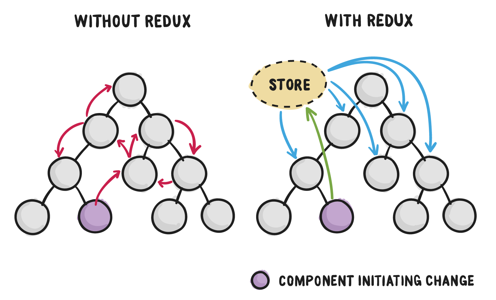

# 2 ans de React !

Depuis fin 2014, et un virage radical vers l'écosystème React, j'ai eu l'occasion de mener plusieurs projets (applis pros, mobiles/hybrides, sites web...) sur cette stack : React, Webpack, Babel, npm...

Ces deux années ont été très prolifiques dans la communauté JavaScript et React, le tooling est encore parfois exotique, mais il se stabilise et de gros progrès ont été faits sur la documentation.

**Nous disposons maintenant d'un écosystème incroyablement riche et dynamique, et d'un paradigme "universel" pour construire les applications de demain, web ou natives.**

React est la bibliothèque de facto pour ce type d'applications, mais on peut le remplacer assez facilement par une alternative comme [Preact](https://preactjs.com/) ou [Inferno](http://infernojs.org/), donc toutes les connaissances acquises sur cette bibliothèque **et son écosystème** sont exploitables ailleurs dans la communauté JavaScript.

Voici un petit recap de cette stack magique :)

## TL;DR;

React en lui-même est le plus simple à appréhender dans cette stack.

Son écosystème, riche et évolutif, l'est moins.

## Babel/ES2015


### Use next generation JavaScript, today.

La communauté JavaScript a massivement adopté le transpileur Babel, qui permet de coder en JavaScript version ES2015 ou supérieure puis de convertir en code compatible avec les navigateurs du marché.

Pour apprendre ES2015 et plus :
  - [articles sur putaindecode.io](http://putaindecode.io/fr/tag/ES6)
  - exercices en ligne : [es6katas.org](http://es6katas.org)
  - tutorial Babel : [babeljs.io](http://babeljs.io/docs/learn-es2015)  
  - comparaisons ES5/ES2015 : [es6-features.org](http://es6-features.org/#BlockScopedVariables)

Vous pouvez très bien faire de l'ES2015 sans Babel, puisque [les navigateurs modernes en supportent une grande partie](https://kangax.github.io/compat-table/es6/), mais le support est inégal, d'où l'idée d'utiliser un transpileur comme Babel qui convertit en ES5.

Le format JSX, est devenu un standard qui peut simplifier le développement :

 - il permet de centraliser la présentation et la logique d'un composant au même endroit
 - d'utiliser une syntaxe XML-like plus rigoureuse, mais bénéfique
 - d'utiliser du JavaScript pur au lieu d'un pseudo-langage comme on trouve dans les moteurs de template habituels

Ça peut paraître déroutant au début mais ça rentre vite !

Plus d'infos sur JSX dans [Introducing JSX](https://facebook.github.io/react/docs/introducing-jsx.html) sur la doc React.

## npm


Quel que soit votre besoin, il y a sûrement déjà un module npm pour ça :)

Pour bien choisir vos packages, regardez l'activité du projet sur GitHub (commits, issues, tests, contributeurs...)

### Moins de code c'est moins de bugs

Votre appli doit utiliser un maximum de code externe, qui est déjà validé, testé... séparément. Publiez un maximum de modules indépendants, en open source si possible, et utilisables hors-contexte ([FIRST principle](https://addyosmani.com/first/)).

Ceci implique de suivre les corrections/évolutions des dits modules et d'utiliser le [semantic versioning](https://docs.npmjs.com/getting-started/semantic-versioning) à bon escient.

NB: Dans sa lancée open-source, Facebook vient de publier une alternative au CLI npm : [yarn](http://yarnpkg.org) plus rapide, fiable et sécurisé.


## Webpack


### Le saviez-vous ?

Webpack a coûté aux devs **2.312.533 heures** en 2015. Par jour.

### Un grand pouvoir implique de grandes responsabilités

Webpack est puissant, il remplace browserify ou vos multiples tâches grunt, gulp, blurp qui géraient votre pipeline d'assets.

À partir du votre point d'entrée de votre application uniquement, par exemple `index.js`, il est capable de servir et bundler toutes les dépendances (code, images, CSS...) de votre projet automatiquement, grâce aux nombreux [loaders](https://webpack.github.io/docs/loaders.html).

Pour cela, les assets doivent être correctement déclarés dans le code :

```js
// require some CSS
import styles from './styles.css'
const ex1 = <div className={ styles.title }>title</div>

// require an image
import logo from './logo.png'
const img = 
```

Et la célèbre [config de webpack](https://webpack.js.org/configuration/) permet de tuner votre build à tous les niveaux.

Plus de détails sur Webpack sur [les articles Putain de code ! dédiés](http://putaindecode.io/fr/tag/webpack).

## CSS


### Le saviez-vous ?

Le CSS est un sport de haut niveau.

### CSS in 2016

Selon la complexité de vos designs, le CSS peut être ce qui prend le plus de temps, entre l'intégration, le responsive, et les animations.

Et la qualité et la modularité du CSS est essentielle pour la maintenabilité des applications.

Pour créer des composants réutilisables nous pouvons maintenant utiliser les [CSS modules](https://github.com/css-modules/css-modules), qui ont l'avantage d'être du CSS classique, mais d'être scopés aux composants, et, accessibles depuis le JavaScript (plus de CSS global). Et le [CSS in JS](https://youtu.be/WyFGfMFjfH4?t=26m23s) peut compléter/remplacer si besoin pour les cas les plus dynamiques.

A défaut, vous pouvez toujours utiliser du CSS global si vous respectez scrupuleusement les [conventions BEM](http://putaindecode.io/fr/articles/css/bem/). Découvrez d'autres [articles dédiés au CSS sur putaindecode.io](http://putaindecode.io/fr/tag/css).

Il existe plusieurs bibliothèques de composants UI assez fournies pour React :

 - [rebass](http://jxnblk.com/rebass/)
 - [ant.design](http://ant.design)
 - [semantic-ui](http://semantic-ui.com)
 - [react-toolbox](http://react-toolbox.com/)
 - [blueprintjs](http://blueprintjs.com)

Et voici un article recensant des [librairies de composants React open-source](http://davidwells.io/19-open-source-react-component-libraries-to-use-in-your-next-project/).

## React : Learn once, run everywhere


Plus qu'une bibliothèque ou un framework, React est un paradigme de programmation d'interfaces utilisateurs, qui permet d'adresser de nombreuses plateformes, avec toujours du code React "standard".

Théoriquement, une application codée en React est capable de produire n'importe quel output, par exemple du HTML pour le web, du natif avec [react-native](https://facebook.github.io/react-native/), du [WebGL](https://github.com/ProjectSeptemberInc/gl-react), du [terminal](https://github.com/Yomguithereal/react-blessed), de la [musique](https://github.com/FormidableLabs/react-music)...

Et pour toutes ces targets, une convention générale s'applique :

<pre><code style="font-size:2em">ui = f(state)</pre></code>

À tout moment, à partir un `state` donné, une application ou un composant React est capable de se "render" correctement dans l'état désiré.

Le fonctionnement interne est donc plutôt straightforward, les composants se passent simplement des `props` (valeurs et callbacks) de parent à enfant, et certains composants peuvent avoir un `state` local qui, une fois modifié, déclenchera son re-render, ainsi que celui de ses enfants, en optimisant les performances grâce au Virtual Dom.

Les composants doivent être simples, focus, composables.

```jsx
<Toolbar>
  <Icon name="success" onClick={ onClickSuccess } />
  <Menu>
    <Icon name="warning" onClick={ onClickWarning } />
    <Icon name="error" onClick={ onClickError } />
  </Menu>
</Toolbar>
```

Au niveau performances, React ne fait pas de miracles malgré le [virtual-dom](http://reactkungfu.com/2015/10/the-difference-between-virtual-dom-and-dom/);

À chaque fois qu'un composant reçoit de nouvelles props ou modifie son state, React appelle la méthode render de ce dernier ainsi que de ces descendants. Même s'il ne modifie pas le DOM, le fait de comparer les deux arbres retournés par render peut s'avérer coûteux si votre composant présente beaucoup de contenu. Heureusement, React permet aux développeurs d'intervenir avant le render et l'annuler s'il n'est pas nécessaire avec shouldComponentUpdate.


Plus d'[articles sur React sur putain de code](http://putaindecode.io/fr/tag/react)

## Redux

[](https://css-tricks.com/learning-react-redux/)

Pour les applications plus complexes, [redux](http://reduxjs.org) va gèrer l'état de l'application de manière globale et externe aux composants, standardiser les évènements (actions), gérer les re-renders, et permettre d'aller vers des [interactions plus avancées](https://github.com/markerikson/redux-ecosystem-links).

Idéalement, [tous vos composants sont dumbs](https://medium.com/@dan_abramov/smart-and-dumb-components-7ca2f9a7c7d0#.j9rp2pr98) et votre gestionnaire de state (par exemple redux) va gérer l'intelligence de l'application et les re-renders de manière découplée et optimisée.

Plus d'articles sur redux sur Putain de code ! : http://putaindecode.io/fr/tag/redux/

## Tips

### Storybook 

Utiliser un outil comme [storybook](https://github.com/storybooks/react-storybook) permet de travailler sur les composants hors-contexte, de pouvoir les visualiser dans différents états pendant que vous travaillez... et ainsi d'avoir une base saine de composants réutilisables.

Votre bibliothèque de composants peut même être un projet à part, que vous importerez dans vos différentes applications. Par exemple, Cloudflare publie séparément [tous ses composants UI réutilisables](ex : https://github.com/cloudflare/cf-ui).

### Composition

Utilisez au maximum la composition de composants React pour garder des composants simples et réutilisables.

Plus de détails sur le [pattern "higher order components"](http://putaindecode.io/fr/articles/js/react/higher-order-component)

### nvm

Utilisez [Node Version Manager](https://github.com/creationix/nvm) aka nvm qui permet de gérer plusieurs environnements Node.js sur une même machine. Indispensable pour travailler sur plusieurs projets.

### Learning curve

Concentrez-vous sur une techno/outil à la fois et n'utilisez pas ce dont vous n'avez pas encore besoin.

> Make it work, make it right, make it fast.

## Comment démarrer ?

Pour créer une application, le plus simple est d'utiliser [create-react-app](https://github.com/facebookincubator/create-react-app).

Si c'est pour créer un composant React que vous allez publier, alors [nwb](https://github.com/insin/nwb) est plus adapté.

Pour créer un site web comme [putaindecode.io](http://putaindecode.io) vous pouvez utiliser un générateur de site statique comme [phenomic.io](http://phenomic.io).

## Pourquoi c'est si complexe ?

Cette stack, qui peut paraître lourde en outillage, permet de créer des apps riches, performantes, testables, évolutives, multi-plateformes.

ES2015 et React en eux-mêmes ne sont pas plus compliqués qu'Angular (au contraire) et simplifient plutôt le code et le workflow de développement.

Une fois l'outillage en place et assimilé, la productivité est excellente (ES2015, npm, tests, developer experience, dev/build/deploy...).

## Must read and watch

 - [Intro to React](https://facebook.github.io/react/tutorial/tutorial.html)
 - Free videos [egghead.io/react-fundamentals](https://egghead.io/courses/react-fundamentals)
 - Free videos [egghead.io/getting-started-with-redux](https://egghead.io/courses/getting-started-with-redux)
 - [You might not need redux](https://medium.com/@dan_abramov/you-might-not-need-redux-be46360cf367#.8swndjba2)
 - [Smart VS dumb components](https://medium.com/@dan_abramov/smart-and-dumb-components-7ca2f9a7c7d0#.v583rvea1)
 - [Les patterns Provider & Higher-Order Component avec React](http://putaindecode.io/fr/articles/js/react/higher-order-component/)
 - [React higher components in depth](https://medium.com/@franleplant/react-higher-order-components-in-depth-cf9032ee6c3e#.t74wxicu0)

## Liens

> Quelques pépites

 - [create-react-app](https://github.com/facebookincubator/create-react-app) : CLI complet pour faire une application react
 - [nwb](https://github.com/insin/nwb) : CLI complet faire un composant react (dev,build,demo,tests,npm...)
 - [react-css-components](https://github.com/andreypopp/react-css-components) : créer des composants React à partir de CSS
 - [redux-ecosystem-links](https://github.com/markerikson/redux-ecosystem-links)
 - [npm scripts docs](https://docs.npmjs.com/misc/scripts)
 - [aframe-react](https://github.com/ngokevin/aframe-react) : Build VR experiences with A-Frame and React
 - [reactpatterns.com](http://reactpatterns.com) : quelques patterns react
 - [phenomic.io](http://phenomic.io) : react-based static site generator
 - [jsbooks.revolunet.com](http://jsbooks.revolunet.com) : free JavaScript ebooks


