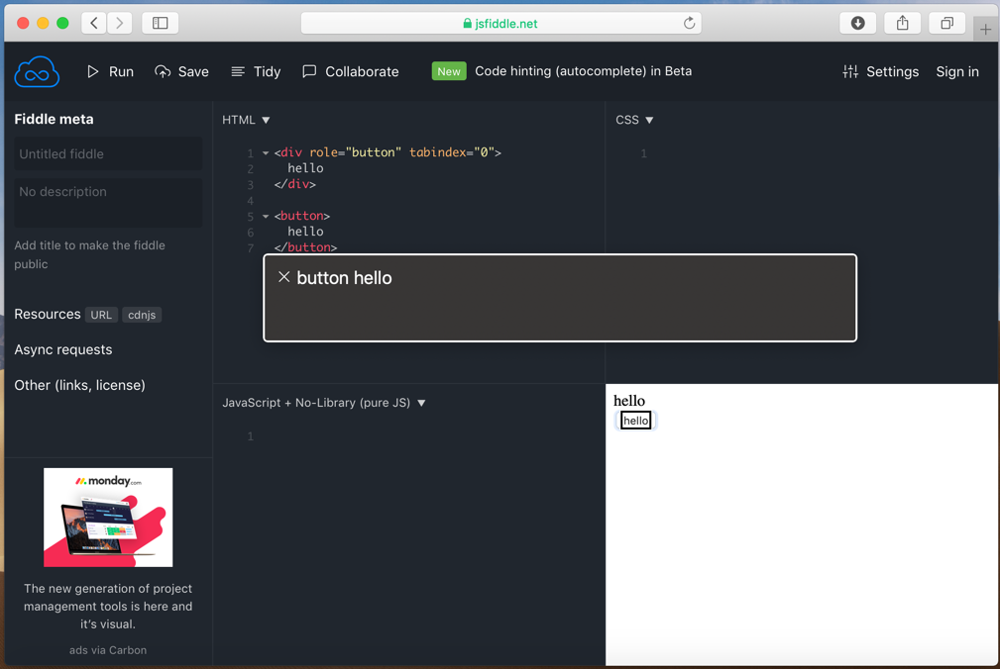
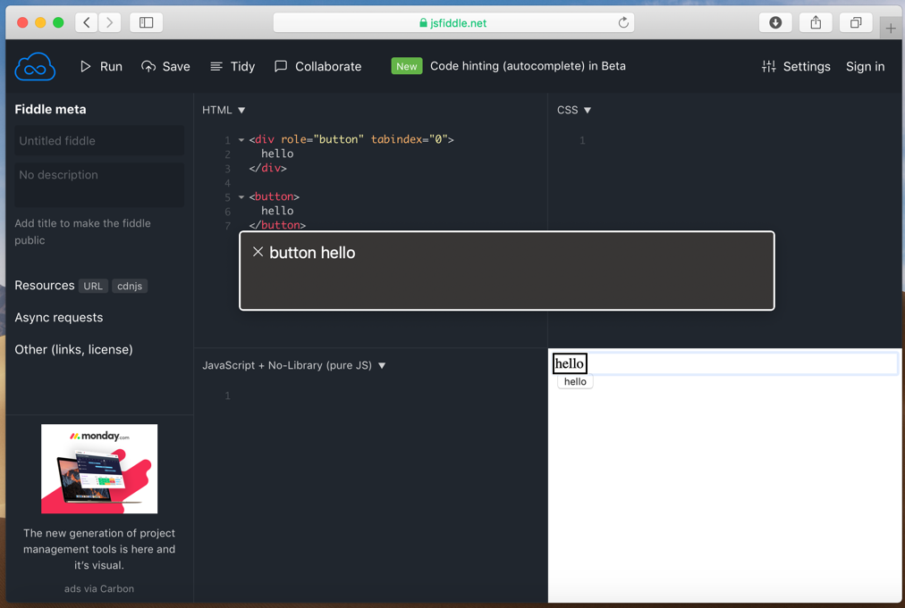

Dans la specification HTML, l'élément `<div />` est décrit comme
[n'ayant aucun sens particulier](https://html.spec.whatwg.org/multipage/grouping-content.html#the-div-element).
C'est un élément extrêmement générique, à tel point qu'on pourrait le nommer
`<view />`:

- son style par défaut est extrêmement léger (`display: block`, c'est tout) et
  facile à reset
- il accepte à peu près tout élément comme enfant

Présenté comme ça, `<div />` semble être la brique de base parfait pour créer un
système de composants. Si on utilise principalement cet élément, on pourra
imbriquer tous nos composants comme on le souhaite sans être contraint par le
contexte.

Pourtant, voilà une bonne dizaine d'années qu'on entend parler de
[divite](https://fr.wiktionary.org/wiki/divite), ou "fait d'utiliser trop de
div". Parmi les deux citations sur wiktionnaire:

> En premier lieu, il faut donc surtout éviter le syndrome de la « divite »,
> c’est-à-dire de considérer `<div>` comme un élément bon à tout faire, et ne
> l’exploiter qu’en dernier recours lorsqu’aucun autre élément n’existe. <br />
> — (Rodolphe Rimelé , HTML 5 : Une référence pour le développeur web, 2011)

> La "divite aiguë" (l’utilisation abusive de balises div) est souvent le
> symptôme d’un code mal structuré et excessivement compliqué. <br /> — (Simon
> Collison, Cameron Moll, Andy Budd , Maitrise des CSS)

## Une `<div />` pour le styling

Aucun souci, vous pouvez continuer à le faire parce que c'est exactement ce
qu'on veut, que l'élément n'ait pas d'importance sémantique.

Un certain courant de l'intégration préconise d'utiliser CSS avec toutes sortes
d'astuces pour éviter à tout prix d'avoir des `<div>` (ou plus généralement des
éléments) pour le styling.

Plus jeune, j'avais tendance à suivre cette approche et me suis heurté à une
problématique de taille par la suite:

c'est 👏 juste 👏 pas 👏 pratique

Prenons un exemple simple. J'ai la structure suivante:

```javascript
<>
  <Header />
  <Article />
</>
```

L'équipe de design souhaite les séparer visuellement de `10px`. Deux approches
s'offrent à moi.


1.  J'ajoute un `<Spacer />` entre les deux éléments, qui sera une `<div />`
    avec la hauteur souhaitée pour décaler du contenu visuellement, `<Header />`
    et `<Article />` continuent leur vie: l'impact de ma modification est
    localisée, il n'y aura donc pas de regression.
2.  J'ajoute une `marginBottom` à `<Header />` (ou un `marginTop` à
    `<Article />`)
    - Soit j'ajoute l'altération systématiquement, ce qui entrainera
      possiblement des regressions visuelles aux autres endroits où mes `Header`
      ou `Article` sont utilisés
    - Soit j'ajoute un paramètre `marginTop` ou `marginBottom`, et ajoute de la
      complexité au composant
    - Soit je permets de passer un `style` et je devrai vérifier qu'il n'y a pas
      de conflit à chaque fois que je mettrai le composant à jour
    - Soit je permets de passer un `className`, j'aurai la même vérification à
      faire, en gardant en tête la spécificité des sélecteur

Les vieux de la vieille de l'intégration vous diront que c'est ridicule
maintenant qu'il y'a CSS, que c'est une
[`technique d'antan`](https://en.wikipedia.org/wiki/Spacer_GIF) pour les layouts
en tableaux. Il y a cependant une différence primordiale: **le contexte**. À
l'époque, le `spacer.gif` était un hack malin pour contourner une contrainte
technique, aujourd'hui, utiliser un `<Spacer />` est un moyen de limiter la
responsabilité d'autres composants, de manière à les rendre plus facilement
réutilisables.
[Certains points de vue](https://twitter.com/sophiebits/status/759898608913174528)
autour de ce qu'un composant devrait autoriser comme style sont particulièrement
intéressants lorsqu'ils sont mis dans cette perspective.

## Une `<div />` pour les boutons

> Just use a `<button />` > <br /> — Most people

Utiliser un élément `<div />` ou `<a />` pour représenter un `button`
(sémantiquement : une action sur la page) est très souvent mal perçu.

Prenons quelques cas où nous pourrions être amenés à avoir besoin de déroger au
`<button />`:

- mon bouton doit être situé dans du contenu phrasé, je n'ai selon la
  spécification pas le droit d'y mettre un élément `<button />`, je vais donc
  avoir tendance à utiliser un `<a />` ou un `<span />`
- je veux arranger les éléments enfants du bouton avec un layout flex horizontal
  non aligné au centre (je vous laisse profiter de
  [l'exemple](https://jsfiddle.net/bloodyowl/Lfcut68p/10/))
- j'ai une approche par composants, et je n'ai pas le temps de vérifier à chaque
  fois que j'utilise un bouton que tous ses enfants sont du contenu phrasé: j'ai
  un composant existant représenté par une `<div />`, je ne vais pas m'amuser à
  rajouter un paramètre à ce composant et à tous les composants qu'il utilise
  pour qu'ils rendent des `<span />` plutôt que des `<div />`

Puisque ces cas existent et sont légitimes: comment fabrique-t-on un composant
`<Button />` accessible et qui marche dans tous les cas ?

```javascript
let Button = ({ onPress, ...props }) => (
  <div
    role="button" // les synthèses vocales comprennent qu'il s'agit d'un bouton
    tabIndex={0} // l'élément est navigable au clavier
    onKeyUp={event => {
      /* Space & Enter */
      if (event.keyCode === 32 || event.keyCode === 13) {
        onPress();
      }
      if (props.onKeyUp) {
        props.onKeyUp(event);
      }
    }}
    onClick={_ => {
      onPress();
      if (props.onClick) {
        props.onClick(event);
      }
    }}
    {...props}
  />
);
```

> NOTE: Vous pouvez également faire un `<InlineButton />` pour les cas où vous
> avez besoin qu'il s'agisse d'un contenu phrasé.

Comme vous pouvez le voir: `<button />` et `<div />` sont radicalement
différents lorsqu'ils sont lus par VoiceOver.





Ce composant sera interprété de la même façon qu'un `<button />` et vous libère
des contraintes de ce dernier. Énorme avantage en plus: vous n'avez à faire
l'abstraction qu'une seule fois !

## Les `<div />` de décoration

On peut souvent trouver des `<div />` chargées de simple décoration (des ombres
portées déportée de l'élément où elle est accrochée visuellement pour atteindre
60FPS, des zigouigouis, des pétouilles …), et on se verra souvent conseiller de
plutôt utiliser des pseudo-elements comme `:before` et `:after`.

Pour commencer, je trouve ça beaucoup plus lisible d'avoir un élément pour le
gérer:

```javascript
let Card = ({ children }) => (
  <div className="Card">
    <div className="Card-shadow" />
    <div className="Card-content">{children}</div>
  </div>
);
```

que d'avoir à aller dans la feuille de style pour aller voir mon zigouigouis qui
porte le nom `:before` ou `:after`, ce qui ne m'aide pas des masses à visualiser
son intérêt. Avec un element, je peux en plus très facilement le transformer en
un composant si j'ai besoin qu'il ait un cycle de vie ou un état local !

Qui plus est, je n'ai pas forcément la possibilité technique d'utiliser CSS, je
peux devoir utiliser des styles inline, les pseudo-éléments n'y seront pas
disponibles.

## Une `<div />` pour les champs texte ?!

Si je veux un champ texte qui grandit avec son contenu (qui apporte de nombreux
avantages pour l'utilisateur) avec des éléments sémantiques je dois utiliser un
`<textarea />` et mesurer sa nouvelle taille supposée (soit sur l'élément lui
même, en définissant sa hauteur à `0` à chaque keystroke pour mesurer sa taille,
soit en utilisant la même technique sur un élément masqué dans le DOM possédant
les mêmes propriétés de layout). Ces techniques de mesures sont contraignantes:
on doit garder en tête le layout, le `box-sizing` de l'élément, et notre
interface risque d'avoir des effets visuellement désagréables comme des "sauts"
de l'élément.

Là encore, utiliser une `<div contentEditable />` non contrôlée peut nous
simplifier la vie:

```javascript
<>
  <label htmlFor="input">Mon champ</label>
  <div
    id="input"
    role="textbox"
    contentEditable={true}
    onInput={event => this.setState({ value: event.target.innerText })}
  />
</>
```

Pour implémenter un placeholder, une `<div />` en position absolute fera
l'affaire.

Apprenons à aimer à nouveau la `<div />`, si toutefois on prend bien soin de son
accessibilité. Utiliser des `<div />` comme briques principales, c'est rendre
composable toute son application.

Les éléments dits sémantiques sont souvent des boites noires, contenant leur
nature sémantique, leur style et leur comportement, et si l'on veut les changer,
on doit annuler des comportement non déterminés à l'avance (c'est l'équivalent
conceptuel de `preventDefault`: "annule quelque chose, mais je ne sais pas
quoi"). Utiliser des `<div />` avec des attributs `role` et `aria-*` change
complètement le paradigme: notre élément sera une vue pour lequel **nous**
spécifions le style, le comportement et la sémantique.

C'est une façon différente de penser son application web: construire du
spécifique avec des briques génériques plutôt que de rendre générique des
briques spécifiques.

N'ayons plus une peur déraisonné d'utiliser des `<div />`, apprenons juste à les
rendre sémantiques.

Bisous bisous.
