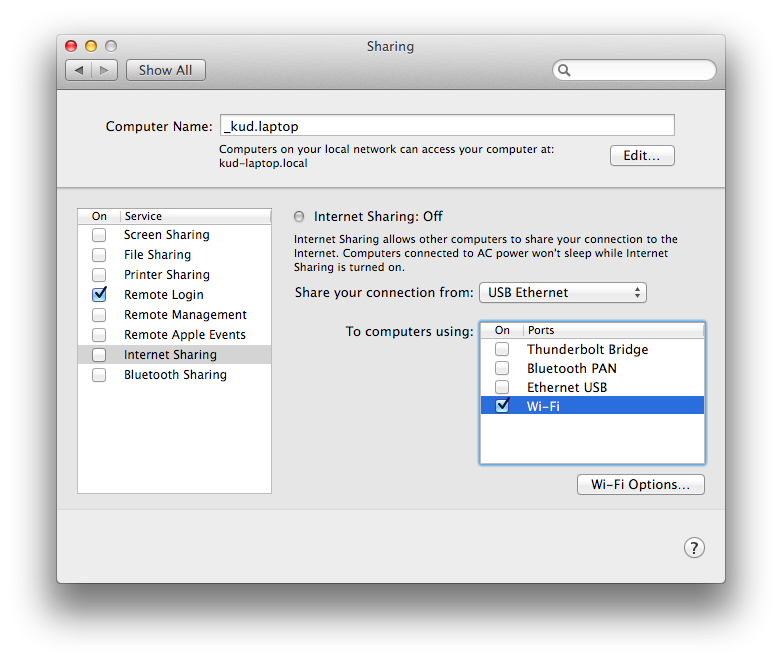
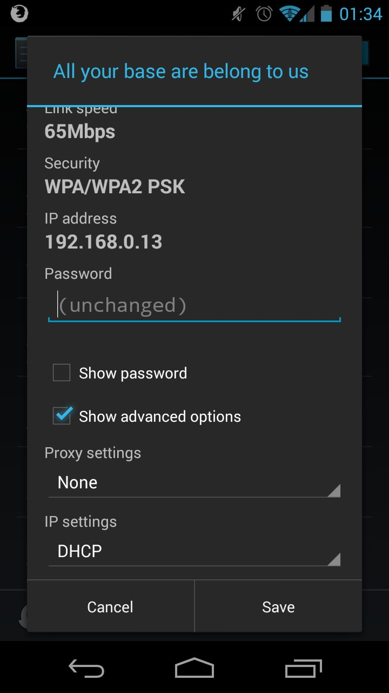

Dernièrement, j'ai voulu accéder avec mon Smartphone à ma machine virtuelle (_VM_) de développement qui se trouve sur mon poste de travail (_machine ou poste hôte_). Ma machine virtuelle me permet de reproduire à l'identique la production afin d'avoir le moins de marge d'erreur possible entre la phase de développement et la phase de mise en production.

A ce moment là, j'accédais à ma machine virtuelle à partir de mon poste via le fichier _hosts_ comprenant ceci :

```
192.168.1.145 monsite.dev
```

Le problème est que seul mon poste est au courant de la résolution du nom de domaine de par cette méthode.

Étant donné qu'il est laborieux de changer des _hosts_ sur un appareil comme un téléphone et que je n'ai pas non plus envie de dupliquer cette modification sur chaque appareil, il me fallait trouver une solution généralisée.

C'est là que **[dnsmasq](http://fr.wikipedia.org/wiki/Dnsmasq)** entre en jeu.

> Dnsmasq est un serveur léger pour fournir les services DNS, DHCP, Bootstrap Protocol et TFTP pour un petit réseau, voire pour un poste de travail. Il permet d'offrir un service de nommage des machines du réseau interne non intégrées au service de nommage global (i.e. le service DNS d'Internet). Le service de nommage est associé au service d'adressage de telle manière que les machines dont le bail DHCP est fourni par Dnsmasq peuvent avoir automatiquement un nom DNS sur le réseau interne. Le logiciel offre un service DHCP statique ou dynamique.

## dnsmasq, le serveur dns tout petit

**dnsmasq** va me permettre de faire plusieurs choses :

- accélérer la résolution dns
- ne pas polluer le réseau interne de la boite avec des résolutions de domaines propre à votre poste (imaginez que vous soyez plusieurs à avoir _monsite.dev_ (ce qui est le cas dans notre boite)); une résolution se ferait uniquement vers un seul poste donc impossible de faire sans si vous êtes plusieurs
- ne pas dupliquer sur chacun appareil la résolution dns
- réussir à résoudre un nom de domaine sur un appareil où le fichier _hosts_ est difficile voire impossible d'accès

Cependant, tout n'est pas si rose, je vais vous montrer pourquoi après.

### Partage de connexion

Je vous propose dans un premier temps de partager votre connexion via le Wifi sous Mac OS X afin :

- d'avoir constamment un débit stable et performant; étant donné que vous êtes souvent devant votre poste pour tester sur différents appareils, en partageant votre connexion via Wifi, vous vous assurez d'avoir un excellent débit, chose qui n'est pas toujours évidente quand le wifi de votre boite est un peu / souvent trop loin
- d'utiliser le serveur dns (dnsmasq) que vous allez monter

Pour cela, il suffit de faire : `System Preferences > Sharing > Internet Sharing` puis choisir `Ethernet` en source, et `Wifi` en sortie. (Je vous conseille d'ailleurs de protéger votre Wifi avec une clé WPA2).

<figure></figure>

_Ici, c'est USB Ethernet en source car je suis sur un Mac Book Air donc aucun port ethernet natif mais choisissez Ethernet si possible._

Une fois que le partage de connexion via Wifi est activé, vous pouvez vous y connecter avec votre smartphone (ou tablette).

Cela crée alors un nouveau réseau privé entre votre machine hôte et votre téléphone avec des adresses comme `192.168.2.x`. La machine hôte aura sûrement l'adresse `192.168.2.1` et votre téléphone très probablement `192.168.2.2`.

C'est alors un autre réseau que le réseau interne à la boite en `192.168.1.x`.

Notez aussi que la machine hôte, faisant bridge, donne les informations en cascade aux appareils connectés. Ce que vous spécifiez comme serveurs dns sur la machine hôte sera alors ceux utilisés par les appareils étant connectés à votre partage de réseau.

### Aaaah dnsmasq !

On est sous Mac OS X, la vie est si simple, on installe **dnsmasq** via **homebrew**.

#### dnsmasq via homebrew

```
$ brew install dnsmasq
```

#### configuration de dnsmasq

Une fois installé, on copie la configuration :

```
$ cp /usr/local/opt/dnsmasq/dnsmasq.conf.example /usr/local/etc/dnsmasq.conf
```

puis on édite le comme ceci :

```
# Add domains which you want to force to an IP address here.
# The example below send any host in double-click.net to a local
# web-server.
#address=/double-click.net/127.0.0.1
address=/monsite.dev/192.168.1.145

# If you want dnsmasq to listen for DHCP and DNS requests only on
# specified interfaces (and the loopback) give the name of the
# interface (eg eth0) here.
# Repeat the line for more than one interface.
#interface=
# Or you can specify which interface _not_ to listen on
#except-interface=
# Or which to listen on by address (remember to include 127.0.0.1 if
# you use this.)
listen-address=0.0.0.0
# If you don't want dnsmasq to read /etc/hosts, uncomment the
# following line.
no-hosts
```

Nous précisons dans un premier temps la résolution du nom de domaine `monsite.dev` (notez que c'est du wildcard, donc pas besoin de préciser les sous-domaines), puis nous indiquons que le serveur DNS marche sur toutes les IPs de la machine hôte et enfin nous indiquons que nous ne voulons pas prendre en compte le fichier `/etc/hosts` vu qu'on spécifie les résolutions via `address`.

Cela permettra à terme de ne plus gérer le fichier `/etc/hosts` et de tout spécifier dans `dnsmasq.conf`.

#### lancer dnsmasq au démarrage de la machine

On copie le fichier de démon dans le dossier qui va bien puis on lance le démon.

```
$ sudo cp -fv /usr/local/opt/dnsmasq/*.plist /Library/LaunchDaemons
$ sudo launchctl load /Library/LaunchDaemons/homebrew.mxcl.dnsmasq.plist
```

#### utiliser le serveur dnsmasq

Etant donné que vous partagez votre connexion et que votre poste fait hôte, le serveur dns utilisé sera celui installé sur votre poste, donc rien à faire.

Sinon :

- vous pouvez changer le serveur dns de la machine hôte dans `network` et dans ce cas, que ce soit sur vos appareils connectés au wifi ou votre machine principale, vous utiliserez **dnsmasq** mais je vous le déconseile car j'ai constaté que j'atteignais trop facilement le nombre de connexions maximum.

- vous pouvez aussi modifier le serveur dns de l'appareil connecté au wifi partagé :

_(Sous Android)_

`Wifi > Press on the current connnection > Modify network > Show advanced options`

<figure></figure>

Mais quel intérêt car vous devrez faire cela sur tous vos appareils connectés

- vous pouvez aussi éditer le fichier `/etc/bootpd.plist` qui définit toute votre configuration de partage de connexion :

```
$ sudo $EDITOR /etc/bootpd.plist
```

```xml
<?xml version="1.0" encoding="UTF-8"?>
<!DOCTYPE plist PUBLIC "-//Apple//DTD PLIST 1.0//EN" "http://www.apple.com/DTDs/PropertyList-1.0.dtd">
<plist version="1.0">
<dict>
  <key>Subnets</key>
  <array>
    <dict>
      <key>_creator</key>
      <string>com.apple.InternetSharing</string>
      <key>allocate</key>
      <true/>
      <key>dhcp_domain_name_server</key>
      <array>
        <string>192.168.2.1</string>
      </array>
      <key>dhcp_router</key>
      <string>192.168.2.1</string>
      <key>lease_max</key>
      <integer>86400</integer>
      <key>lease_min</key>
      <integer>86400</integer>
      <key>name</key>
      <string>192.168.2/24</string>
      <key>net_address</key>
      <string>192.168.2.0</string>
      <key>net_mask</key>
      <string>255.255.255.0</string>
      <key>net_range</key>
      <array>
        <string>192.168.2.2</string>
        <string>192.168.2.254</string>
      </array>
    </dict>
  </array>
  <key>bootp_enabled</key>
  <false/>
  <key>detect_other_dhcp_server</key>
  <true/>
  <key>dhcp_enabled</key>
  <array>
    <string>bridge100</string>
  </array>
  <key>use_server_config_for_dhcp_options</key>
  <false/>
</dict>
</plist>
```

`192.168.2.1` est l'adresse de votre machine hôte dans le réseau de partage.

## Oh oui, j'oubliais, Mac OS X peut être lourd parfois

Oui, quand vous créez un partage de connexion sur Mac OS X, il lance son propre serveur dns s'appelant **_mdnsresponder**. C'est le système _Bonjour_ de iOS/Mac OS X permettant à n'importe quel appareil Apple de communiquer entre eux. Le problème c'est qu'il risque de marcher sur les pieds de **dnsmasq**.

Faites donc un `$ sudo lsof -i :53` et vous pourrez éventuellement voir que **_mdnsresponder** est lancé aussi bien en ipv6 qu'en ipv4 sur le port 53. Cela vous empêchera de lancer **dnsmasq**.

Ce que je vous propose dans ces cas là, c'est de couper votre partage de connexion, puis notez le pid de **_mdnsresponder** via `$ sudo lsof -i :53`, de le `sudo kill :pid`, de lancer `$ sudo dnsmasq` puis de relancer le partage de connexion. Comme ça **_mdnsresponser** ne prendra plus la place de **dnsmasq**.

Autre point, évitez, mais vraiment, de nommer vos noms de domaines personnels en `.local`. En effet, ceux-ci sont plutôt réservés à l'environnement Mac OS X. Ils sont d'ailleurs en rapport avec **_mdnsresponder**. Les `.local` permettent à n'importe quel produit Apple sur le réseau de se connecter à d'autres postes Apple via `nom-de-l-appareil.local`. Votre connexion pourrait alors s'emméler entre le serveur dns de **Bonjour** et votre propre serveur dns.

Happy coding !
